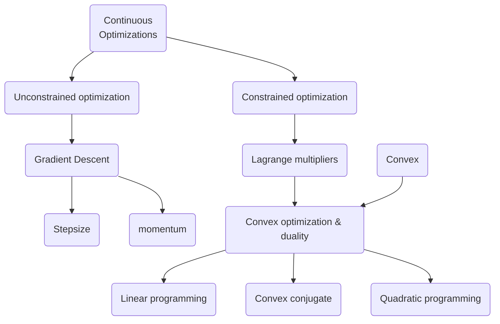

# MML-Part 1

> Mathematical Fundations

[toc]

This part of the book is mainly focused on the fundamental
mathematics, which is rather simple for a student majored in mathematics.

However, I still want to write down some important parts in it,
as a completion of my mathematics learning route and a practice of English
writing.

## Linear Algebra

Easy as pie.

But there is still some technical terms to be memorized.

Matrix <-> Matrices <-> 矩阵

Affine Spaces <-> 仿射空间

## Analytic Geometry

Easy. But at the same time, there're also some terms here.

Orthogonal <-> 正交

Orthonormal <-> 标准正交

## Matrix Decompositions

This part is quite important!
Though some of the contents may be learned before, it worth reemphasizing
such topic for its great significance.

* A square matrix is called defective if it possesses fewer than $n$
		linearly independent eigenvectors.
* A matrix is said to be orthogonal if it satisfies $A^\top=A^{-1}$.

#### Spactral Theorem

If a matrix $A\in\mathbb R^{n\times n}$ is symmetric, there exists an
orthonormal basis of the corresponding vector space $V$ consisting of
eigenvectors of $A$, and each eigenvalue is real.
(This theorem also holds in the infinitely dimensional case.)

This theorem implies that there is always a **eigenvalue decomposition** of
a symmetric matrix.

This can be viewed as a special case of the SVD decomposition.

#### Cholesky Decomposition

A symmtric, positive definate matrix $A$ can be factorized into a product
$A=LL^\top$, where $L$ is a lower-triangular matrix with positive diagonal
elements.

Here, $L$ is called the Cholesky factor of $A$, and $L$ is unique.

(this theorem can be verified by assumption and calculation.)

#### Eigendecomposition

A square matrix $A\in\mathbb R^{n\times n}$ can be factored into

$$A=PDP^{-1}$$

where $P\in\mathbb R^{n\times n}$ and $D$ is a diagonal matrix whose
diagonl entries are the eigenvalues of $A$, if and only if the
eigenvectors of $A$ form a basis of $\mathbb R^n$.
(And the matrix $P$ just contains all the eigenvectors of $A$,
and in fact this decomposition is simply a transformation of the basis.)

#### Singular Value Decomposition(SVD)

Let $A^{m\times n}$ be a rectangular matrix of rank $r$.
The SVD of $A$ is a decomposition of the form

$$A=U\Sigma V^\top$$

with an orthogonal matrix $U\in\mathbb R^{m\times m}$ with column vectors
$u_i$, and an orthogonal matrix $V\in\mathbb R^{n\times n}$ with column
vectors $v_j$.
Morever, $\Sigma$ is an $m\times n$ matrix with $\Sigma_{ii}=\sigma_i\geq0$
and $\Sigma_{ij}=0, i\neq j$.

The diagonal entries $\sigma_i$ of $\Sigma$ are called the singular values,
$u_i$ are called the left-singular vectors, and $v_j$ is called the
right-singular vectors.
By convention, the singular values are ordered, i.e.,
$\sigma_1\geq\sigma_2\geq\sigma_r\geq0$.

The process actually decomposes the matrix (viewed as linear transformation)
into three independent sequential transformations.
A rotation, a scaling and inserting between spaces $\mathbb R^m$ and
$\mathbb R^n$, and another rotation in the new space.

There's a basic way to calculate the SVD of a matrix.
Firstly we can consider the product $AA^\top$ which is a square matrix.
It is easy to verify that the singular value of $A$ is just the square root of
the eigenvalue of $AA^\top$. And at the same time, due to the spectram
theorem, we can always find a orthogonal matrix $U$ such that
$AA^\top=U\Sigma\Sigma^\top U^{-1}$, and here $U$ is just the same as the one
in the defination of the SVD.

After that, we can obtain the other orthogonal matrix by the singular value
equation, say

$$Av_i=\sigma_i u_i$$

And for a right-singular vector without corresponding left-singular vector,
the equation will take the form $Av_i=0$.

## Matrix Approximation

The SVD allows us to represent a matrix $A$ as a sum of a lot of simpler
(low-rank) matrices, which lends itself to a matrix approximation
scheme that is cheaper to compute with much lower space consumption.

We construc a rank-1 matrix $A_i\in\mathbb R^{m\times n}$ as

$$A_i:=u_iv_i^\top$$

which is formed by the outer product of the $i$th orthogonal column vector.
Then the original matrix can be writen as the sum of $A_i$, say

$$A=\sum_{i=1}^r\sigma_iu_iv_i^\top=\sum_{i=1}^r\sigma_iA_i$$

By preserving only the larger singular value and the corresponding singular
vectors, we can get a approximation of the original matrix.

And by Eckart-Young Theorem we know that such approximation is actually the
best one we can expect of a r-rank approximation, which minimizes the difference
between the original matrix and the low-rank matrix in the sense of the
spectram norm.

## Vector Calculus

Already known since freshman year.

## Probability and Distributions

Most of the contents are already learnt in the course on probability theory,
but some are missing and is in need of being acquired.

#### Conjugacy and the Exponential Family

**Bayes theorem** is a simple yet powerful tool for dealing with probability
problems.

$$P\{A|B\}P\{B\}=P\{AB\}=P\{B|A\}P\{A\}$$

A great virtue is that it can be used to rearrange our know distribution and
related parameters.
If we already have some prior knowledge about the distribution of a random
variable, and then after obtaining some newly known knowledge, then
we can use it to refine the posterior distribution.

There are some special case when we can easily compute out the desiring
posterior distribution, using the **conjugate prior**.

Here is a table describing the common conjugate prior and the posterior
distribution and the corresponding likelihood.

|Likelihood|Conjugate prior| Posterior|
|:--|:--|:--|
|Bernoulli|Beta|Beta
|Binomial|Beta|Beta
|Gaussian|Gaussian/inverse Gamma|Gaussian/inverse Gamma
|Gaussian|Gaussian/inverse Wishart|Gaussian/inverse Wishart
|Multinomial|Dirichlet|Dirichlet

#### Sufficient Statistics

A **sufficient statistics** is a statistics that will contain all the information
of a distribution, and thus is sufficient to represent the whole distribution.

For sufficient statistics, we have Fisher-Neyman Theorem:

Let $X$ have probability density function $p(x|\theta)$, the the statistics
$\phi(x)$ are sufficient for $\theta$ if and only if $p(x|\theta)$ can be
writen in the form

$$p(x|\theta)=h(x)g_\theta(\phi(x))$$

where $h(x)$ is a distribution independent of $\theta$ and $g_\theta$
captures all the dependence on $\theta$ via sufficient statistics $\phi(x)$.

#### Exponential Family

Exponential Family <-> 指数族分布

It is the most important family of distribution in Statistics.

An exponential family is a family of probability distributions, parameterized
by $\theta\in\mathbb R^D$, which takes the form

$$p(x|\theta)=h(x)\exp(\langle\theta,\phi(x)\rangle-A(\theta))$$

where $\phi(x)$ is the vector of sufficient statistics.
In general, any inner product can be used in the defination, but most of the time
we'll simply use the standard dot product.

Here the term $A(\theta)$ is the normalization constant that ensures that
the distribution integrates to one and is called the log-partition function
<-> 对数配分函数.

The exponential family gives us a nice way to find the conjugate distribution
of a particular distribution.
Actually a random variable $x$ of the former form has a conjugate prior

$$p(\theta|\gamma)=h_c(\theta)\exp\left(\left\langle\left[\begin{array}{c}\gamma_1\\\gamma_2\end{array}\right],\left[\begin{array}{c}\theta\\-A(\theta)\end{array}\right]\right\rangle-A_c(\gamma)\right)$$

here $\gamma=[\gamma_1,\gamma_2]^\top$ has dimension $\dim(\theta)+1$,
and the sufficient statistics of the conjugate prior are
$[\theta,A(\theta)]^\top$.

## Continuous Optimization

Most of the time we can not find an explicit expression of the best optimization
of the parameters in our model. Then we'll need to apply the numerical
optimization metods.

To be continued.
