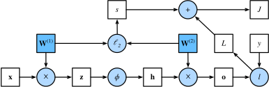

# 多层感知机

### 简单概念

多层感知机是最简单的深度网络。

#### 隐藏层

隐藏层是指在输入层和输出层之间的层，隐藏层的神经元不直接对应于输入或输出，而是对应于输入层和输出层之间的中间层。

实际上因为自然界中很多很多问题根本就不是线性的，因此我们有必要在模型当中加入更多层级转化数据。
类似于叠加多个函数以达到拟合真实数据之间关系的效果。

最简单的实现方法就是将许多全连接层堆叠在一起，每一层的输出都是下一层的输入。
直到生成最后的输出。
前 $L-1$ 曾都当作是表示，最后一层看作线性预测器，这种架构通常称为多层感知机(multilayer perceptron)。
通常缩写为 MLP。

#### 激活函数

要实现从线性到非线性的模型转化，仅仅通过叠加线性映射是没有作用的。
因为我们不难证明仿射变换的复合仍然是仿射变换。

所以需要用一个叫做激活函数的东西来实现非线性的转化。
激活函数的作用是将输入映射到非线性的输出。
常见的激活函数有 sigmoid 函数、tanh 函数、ReLU 函数等。
此时如果以带有单层隐藏层的 MLP 为例，那么整个模型就可以表示为

$$\begin{aligned}\mathbf H &= \sigma(W_1 \mathbf X + b_1) \\\mathbf O &= W_2 \mathbf H + b_2\end{aligned}$$

而当有需要的时候，也可以叠加多层隐藏层，并累计添加多个激活函数，从而产生一些更具表达力的模型。
激活函数通过计算加权和并加上偏置来确定神经元是否应该被激活。

后面我们会详细讲一些激活函数的例子。

* **ReLU函数**

ReLU函数是一种非线性函数，其定义为

$$\mathrm{ReLU}(x) = \max(x, 0)$$

简而言之它就是舍弃掉所有的负项而仅仅保留正数。
计算起来相当快捷而且能够提供所需的非线性性。
效果优良，因而也被人们广泛采用。
甚至可以被称作是一个「伟大的创造」。

ReLU函数同时也存在着许多变体，比如说带参数的pReLU函数，Leaky ReLU函数等等。
例如pReLU函数的定义为

$$\mathrm{pReLU}(x) = \max(x, 0)+\alpha\min(x, 0)$$

* **sigmoid函数**

sigmoid函数是一种非线性函数，其定义为

$$\sigma(x) = \frac{1}{1 + \exp(-x)}$$

它可以将整个 $\mathbb R$ 上的输入映射到 $[0, 1]$ 上，因此通常被称为挤压函数。
sigmoid函数是一个自然的非线性可微函数，通常被用于二元分类问题中输出层的激活函数。
但是在隐藏层当中，现在人们一般更加倾向于使用更加简单、易于训练的ReLU函数。

* **tanh函数**

tanh函数是一种非线性函数，其定义为

$$\tanh(x) = \frac{\exp(x) - \exp(-x)}{\exp(x) + \exp(-x)}$$

它和sigmoid函数类似，能够将所有输入都压缩到 $[-1, 1]$ 之间。

#### 再次实践图像分类

我们将使用之前的Fashion-MNIST数据集来实践一下多层感知机。
手动实现一个简单的多层感知机是相当容易的，不过一旦层数增加这个过程也会变得很麻烦。
届时我们的框架中也有对应的方案来解决这个问题，不过目前我们就只需要简单地手搓一个就好。

具体的代码我们放在 `MLP.py` 当中。

#### 再次图像分类·简单实现

这里又是一次通过调用高级API来实现更加简洁的多层感知机。
我们的代码都放在`eMLP.py` 当中。

### 模型选择、欠拟合和过拟合

机器学习科学家所做的事情是希望发现模式，但我们会希望这些模式能够泛化到新的数据上。

事实上，我们的模型有很大可能在训练数据上拟合得比潜在分布中更加接近，这种现象叫做过拟合(overfitting)。
而如果我们的模型在训练数据上的表现不如在测试数据上的表现，那么我们就说这个模型欠拟合(underfitting)。
用于对抗过拟合的技术就被称为正则化(regularization)。

由于泛化是机器学习中的基本问题，这也是一个相当重要的研究课题。
目前的统计学习理论就致力于研究泛化现象的数学基础。

一项普遍的规律是：**越复杂的模型越容易出现过拟合现象，越大的训练数据集越能有效地降低过拟合情况。**

接着是模型选择的问题。
我们经常会面临这样的问题，需要在许多候选模型当中进行评估选择。
这可能包括几个在本质上完全不同的模型，或者是一些仅仅超参数选择不同的模型。

在训练数据稀缺时可以使用K折交叉验证(K-fold cross-validation)来选择模型。

#### 多项式回归

这里我们通过多项式回归测试一下过拟合现象的存在。
具体代码放在`poly.py`当中。

### Forward & Backward

The automatic calculation of the gradients profoundly simplifies the
implementation of deep learning, while the implementation of the automatic
gradients itself be hidden behind the deep learning framework.

**Forward Propagation** is the main part we will focus on in a deeplearning
model.
As we're going through the forward propagation, the framework automaticly
marks down the paths we'll travelled and draws a **computational graph** of the
model. Then, by applying the chain rule of gradients and seperately calculating
each gradient of the layers, we can easily obtain the required gradient.

A typical computational graph would look like this:

